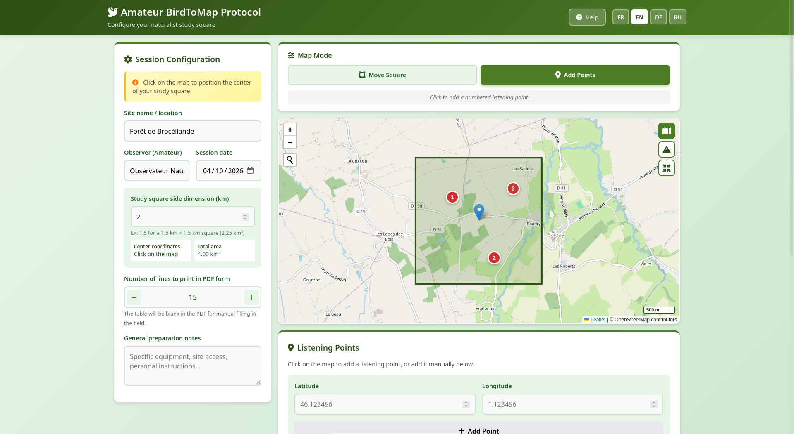

# 🐦 BirdToMap - Amateur Ornithological Listening Protocol

### 📖 About

**BirdToMap** is a free, open-source web application designed for amateur audio-naturalists and birdwatchers who want to structure their field listening sessions. It allows you to define a study square on a map, place listening points, and generate a printable PDF field sheet for recording bird observations.

### 🧠 AI-Assisted Development

This software was designed and developed with the assistance of Qwen 3.7.

### 🔬 Inspiration: The STOC Protocol

BirdToMap is inspired by the **STOC** (*Suivi Temporel des Oiseaux Communs* - Temporal Monitoring of Common Birds), a scientific protocol managed by the French National Museum of Natural History and the LPO (League for the Protection of Birds).

However, BirdToMap is **NOT** a scientific protocol. It is a simplified, amateur-friendly tool that borrows the following concepts from STOC:
- 📐 Definition of a study square (configurable size)
- 🎧 Fixed listening points within the square
- 🎙️ Audio recording for later identification
- ✅ Certainty levels (Certain / Probable / Possible)

> ⚠️ **Important:** BirdToMap does not replace official participatory science programs. It is a personal tool for amateur audio-naturalists who want to improve their bird identification skills through structured practice.

### 🚀 How It Works

1. **️ Configure your study area**
   - Enter the site name, observer name, and date
   - Choose the size of your study square (0.1 to 50 km per side)
   - Click on the map to position the center of your square

2. **📍 Add listening points**
   - Switch to "Add Points" mode
   - Click on the map or enter coordinates manually
   - Points are automatically numbered

3. **📄 Export your PDF**
   - Generate a complete field sheet including:
     - 🗺️ Map with the study square and listening points
     - 📋 List of listening points with exact coordinates
     - 📝 Blank observation table (customizable number of rows)
     - 📖 Amateur observer guide

4. **🎧 Go to the field**
   - Print the PDF
   - Visit each listening point
   - Record audio and note your hypotheses
   - Identify species later at home by reviewing recordings

### 🌍 Translations

BirdToMap supports **4 languages**: 🇫🇷 French, 🇬🇧 English, 🇩 German, 🇷🇺 Russian.

#### Why translations matter

Birdwatching is a global activity. To make this tool accessible to as many amateur audio-naturalists as possible, we need translations in many languages. Every contribution is welcome!

#### How to contribute a translation

1. **Fork** this repository on GitHub
2. Open the file `translations.js`
3. Copy an existing language block (e.g., `fr: { ... }`)
4. Translate all the text values into your language
5. Add your language code to the `translations` object (e.g., `pl: { ... }` for Polish)
6. Add a button in `index.html` in the language selector section
7. **Submit a Pull Request** with your changes

---

## 🇫🇷 Version Française

### 📖 À propos

**BirdToMap** est une application web libre et open-source conçue pour les audio-naturalistes amateurs qui souhaitent structurer leurs sessions d'écoute sur le terrain. Elle permet de définir un carré d'étude sur une carte, d'y placer des points d'écoute, et de générer une fiche de terrain PDF imprimable pour noter les observations d'oiseaux.

### 🧠 Développement assisté par IA

Ce logiciel a été développé avec l'assistance de Qwen 3.7.

### 🔬 Inspiration : le protocole STOC

BirdToMap s'inspire du **STOC** (*Suivi Temporel des Oiseaux Communs*), un protocole scientifique géré par le Muséum National d'Histoire Naturelle et la LPO (Ligue pour la Protection des Oiseaux).

Cependant, BirdToMap n'est **PAS** un protocole scientifique. C'est un outil simplifié et accessible aux amateurs, qui reprend les concepts suivants du STOC :
-  Définition d'un carré d'étude (taille configurable)
- 🎧 Points d'écoute fixes à l'intérieur du carré
- ️ Enregistrement audio pour identification ultérieure
- ✅ Niveaux de certitude (Certain / Probable / Possible)

> ⚠️ **Important :** BirdToMap ne remplace pas les programmes officiels de sciences participatives. C'est un outil personnel pour les audio-naturalistes amateurs qui souhaitent améliorer leurs compétences en identification des oiseaux par une pratique structurée.

### 🚀 Comment ça marche

1. **🗺️ Configurez votre zone d'étude**
   - Saisissez le nom du site, le nom de l'observateur et la date
   - Choisissez la taille de votre carré d'étude (0,1 à 50 km de côté)
   - Cliquez sur la carte pour positionner le centre de votre carré

2. **Ajoutez des points d'écoute**
   - Basculez en mode "Ajouter des points"
   - Cliquez sur la carte ou saisissez les coordonnées manuellement
   - Les points sont automatiquement numérotés

3. **📄 Exportez votre PDF**
   - Générez une fiche de terrain complète incluant :
     - 🗺️ La carte avec le carré d'étude et les points d'écoute
     - 📋 La liste des points d'écoute avec coordonnées exactes
     - 📝 Un tableau d'observation vierge (nombre de lignes personnalisable)
     - 📖 Un guide de l'observateur amateur

4. **Allez sur le terrain**
   - Imprimez le PDF
   - Visitez chaque point d'écoute
   - Enregistrez l'audio et notez vos hypothèses
   - Identifiez les espèces plus tard chez vous en réécoutant les enregistrements

### 🌍 Traductions

BirdToMap supporte **4 langues** : 🇫🇷 Français, 🇬🇧 Anglais, 🇩 Allemand, 🇷🇺 Russe.

#### Pourquoi les traductions sont importantes

L'observation des oiseaux est une activité mondiale. Pour rendre cet outil accessible à autant de audio-naturalistes amateurs que possible, nous avons besoin de traductions dans de nombreuses langues. Toute contribution est la bienvenue !

#### Comment contribuer à une traduction

1. **Forkez** ce dépôt sur GitHub
2. Ouvrez le fichier `translations.js`
3. Copiez un bloc de langue existant (par exemple `fr: { ... }`)
4. Traduisez toutes les valeurs textuelles dans votre langue
5. Ajoutez votre code de langue dans l'objet `translations` (par exemple `pl: { ... }` pour le polonais)
6. Ajoutez un bouton dans `index.html` dans la section du sélecteur de langue
7. **Soumettez une Pull Request** avec vos modifications

---

## 🛠️ Technical Stack (Anglais uniquement)

| Technology | Purpose |
|------------|---------|
|  HTML5 / CSS3 | User interface |
| ⚙️ JavaScript (ES6+) | Application logic |
| 🗺️ Leaflet.js | Interactive maps |
| 🗺️ OpenStreetMap / OpenTopoMap | Map tiles |
| 📄 jsPDF + AutoTable | PDF generation |
| 🖼️ html2canvas | Map capture for PDF |
| 🔍 Leaflet Control Geocoder | Location search |

## 📁 Project Structure
```
BirdToMap/
├── index.html          # Main HTML file
├── style.css           # Stylesheet
├── app.js              # Application logic
├── translations.js     # Multi-language translations
├── favicon.png         # Application icon
├── start.sh            # Linux/macOS launcher (local server)
├── preview_1.jpg       # Screenshot preview
└── README.md           # Help
```


